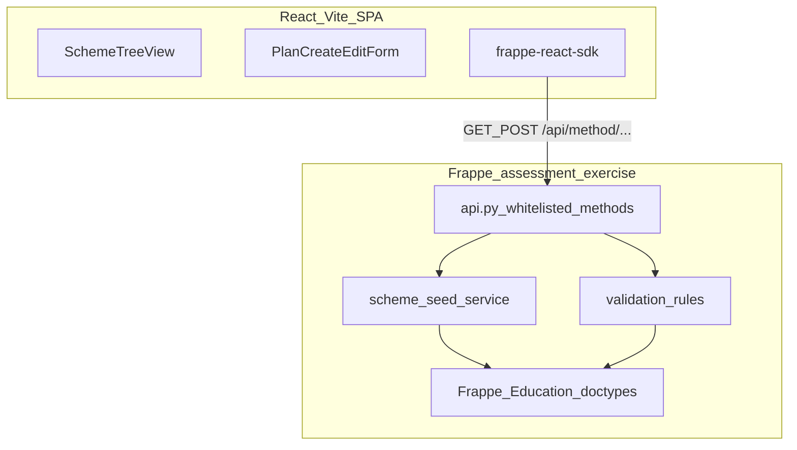

# Assessment Scheme Builder — Implementation Plan

## Current state

- Repo has [README.md](README.md) and [docs/CANDIDATE_EXERCISE_ASSESSMENT_SCHEME.md](docs/CANDIDATE_EXERCISE_ASSESSMENT_SCHEME.md) only.
- Target layout (from README): `backend/`, `frontend/`, `scripts/`, `docs/`.

## Documentation to add (first actionable step)

Create two companion docs under `docs/`:

| File | Purpose |
|------|---------|
| [docs/IMPLEMENTATION_PLAN.md](docs/IMPLEMENTATION_PLAN.md) | Copy of this plan with numbered phases, commands, and acceptance criteria per step |
| [docs/PROGRESS.md](docs/PROGRESS.md) | Checkbox tracker: phase status, hours, blockers, submission checklist |

**Progress tracker format** (maintain after each work session):

```markdown
## Status: Not Started | In Progress | Done

### Phase 0 — Environment
- [ ] Bench + site + education app installed
- [ ] `assessment_exercise` app created and installed
...

### Session log
| Date | Phase | Hours | Notes |
|------|-------|-------|-------|
```

Update `PROGRESS.md` at the end of every session; treat unchecked required items as blockers for submission.

---

## Architecture (target)



**Doctypes (use as-is, do not recreate):**

- `Assessment Group` — Term-I, PT-I, Half Yearly, Internal Assessment, etc.
- `Assessment Criteria` — Theory 80, PT Internal 5, MA 5, SEA 5, Portfolio 5, Practical 30, etc.
- `Assessment Plan` — links Program + Course + Group + Criteria + max marks
- `Program` — Class VI / VII / VIII
- `Course` — subjects (11 per class)

**Scale reference:** 52 plans per section × 4 sections × 3 classes = **624 plans** (seed can start with 1 section per class, then bulk-expand).

---

## Phase 0 — Environment and repo scaffold (1–2 h)

**Goal:** Runnable Frappe site with Education app; empty custom app; frontend toolchain.

1. **Scaffold repo folders**
   - `backend/` — notes or symlink to bench app path (see below)
   - `frontend/` — Vite React-TS app
   - `scripts/` — optional `setup-bench.sh`, `seed-scheme.sh`

2. **Frappe bench** (on developer machine, outside or inside repo — document choice in README):

   ```bash
   pip install frappe-bench
   bench init frappe-bench --frappe-branch version-15
   cd frappe-bench
   bench new-site school.localhost --db-name school_db
   bench get-app education
   bench --site school.localhost install-app education
   bench new-app assessment_exercise
   bench --site school.localhost install-app assessment_exercise
   ```

3. **Frontend bootstrap** in `apps/assessment_exercise/frontend` (or repo `frontend/` copied into app — pick one layout and stick to it):

   ```bash
   yarn create vite . --template react-ts
   yarn add frappe-react-sdk tailwindcss @tailwindcss/vite
   ```

4. **Vite proxy** — route `/api` → `http://school.localhost:8000`.

5. **Acceptance:** `bench start` serves Frappe; `yarn dev` loads SPA; logged-in session can hit a smoke `GET` whitelisted method.

**Progress checkbox:** Phase 0 complete when README documents exact paths and both servers start.

---

## Phase 1 — Domain constants and seed design (1 h)

**Goal:** Single source of truth for CBSE rules before touching ORM.

Create `assessment_exercise/assessment_exercise/scheme/` (or `backend/` mirror):

| Module | Responsibility |
|--------|----------------|
| `constants.py` | Classes VI–VIII; subject lists; category (main/skill/co-scholastic); default max marks |
| `hierarchy.py` | Tree: Academic Year → Term I/II → cycles (PT-I, Internal, Half Yearly, …) |
| `plan_matrix.py` | Which (program, course, group, criteria) tuples exist — drives 52 plans/section |

Encode from spec:

- **Main:** PT 80 + Internal 20 (5+5+5+5) + Half Yearly/Yearly 80 per term
- **Skill (Coding):** PT 50 + Internal 50 (5+5+5+5+30) per term — no separate main exam
- **Co-scholastic:** Internal 5 only, A–E scale
- **Language:** Hindi, Mizo, Manipuri — identical structure, all three seeded

**Acceptance:** Unit-testable pure functions return expected plan count (52 per section) and criteria sums.

---

## Phase 2 — Backend seed service (2–3 h)

**Goal:** Idempotent population of Groups, Criteria, Programs, Courses, Plans.

1. **`seed_master_data()`** — Programs (Class VI–VIII), Courses (11 subjects), Assessment Groups (hierarchy), Assessment Criteria (all components).

2. **`seed_assessment_plans(program, section=None)`** — Create `Assessment Plan` rows from `plan_matrix.py`.

3. **Whitelisted entry point:**

   ```python
   @frappe.whitelist()
   def seed_cbse_scheme(academic_year: str, sections: list | None = None):
   ```

4. **Idempotency:** Check by name/key before insert; safe re-run for dev.

5. **Transactions:** `try/except` + `frappe.db.rollback()` on failure.

**Acceptance:** After seed, Desk or SQL shows expected groups/criteria/plans for one class; curl seed endpoint succeeds twice without duplicates.

---

## Phase 3 — Backend API layer (2 h)

**Goal:** Three required endpoints + shared response shape.

File: `assessment_exercise/api.py` (or `assessment_exercise/assessment_exercise/api/` split by concern).

| Method | Endpoint | Behavior |
|--------|----------|----------|
| GET | `get_assessment_scheme` | Nested tree: Term → Cycle → Subject → Criteria + max marks; filter by `program` (class) |
| GET | `get_assessment_plan_detail` | Single plan + child criteria rows |
| POST | `save_assessment_plan` | Create or update plan + criteria marks |

**Response contract:**

```python
return {"success": True, "data": result}
# or
return {"success": False, "error": "reason"}
```

**Server-side validation** (mirror frontend rules — reject invalid saves):

- Main/Skill: theory + internal term totals consistent with category
- PT caps: main ≤ 80, skill ≤ 50
- Internal sub-components: main = 20, skill = 50
- Co-scholastic: no theory criteria; max 5
- Language courses: same criteria structure

**Acceptance:** README curl examples for all three endpoints; Postman collection optional in `docs/`.

---

## Phase 4 — Frontend foundation (1–1.5 h)

**Goal:** Typed API client and Frappe auth wiring.

1. **Types** — `src/types/assessment-scheme.ts` matching API `data` shapes (Zod optional for form validation).

2. **API hooks** — `useFrappeGetCall` / `useFrappePostCall` with unwrap:

   ```typescript
   const actualData = (data as { message?: T })?.message ?? data
   ```

3. **Layout** — App shell: header (academic year), class selector (VI/VII/VIII), main content area.

4. **Error/loading states** — consistent banners for `success: false`.

**Acceptance:** Scheme loads from API with no hardcoded subject tree in components.

---

## Phase 5 — Frontend features (2–3 h)

### 5a — Scheme viewer (required)

- Tree or nested accordion: Term → Assessment Cycle → Subject → Criteria (max marks)
- Read from `get_assessment_scheme`
- Optional: expand/collapse, subject category badges (Main / Skill / Co-scholastic)

### 5b — Create / edit plan (required)

- Form: class, subject, assessment cycle
- Dynamic criteria rows with max marks
- Load existing via `get_assessment_plan_detail`
- Save via `save_assessment_plan`

### 5c — Client validation (required)

Implement rules from spec § "Validate the scheme rules":

- Warn if theory + internal ≠ 100 (main/skill)
- Block PT > 80 (main) or > 50 (skill)
- Enforce internal sub-component sums (20 / 50)
- Co-scholastic: 5-point only, no theory fields
- Show inline field errors before submit

**Acceptance:** Can create a plan, reload, edit marks, see validation errors without round-trip for obvious mistakes.

---

## Phase 6 — Polish, lint, submission (1–2 h)

1. **README** — bench setup, seed command, frontend dev, API curl samples, demo credentials.
2. **Lint** — `ruff check` (Python), `yarn lint` (TS).
3. **Stretch (only if core done)** — dashboard (plans created vs pending), bulk apply VI–VIII, JSON export.
4. **Submission checklist** — copy from spec into `docs/PROGRESS.md` final section.

---

## Suggested file structure (end state)

```
assessment-scheme-builder-exercise/
├── README.md
├── docs/
│   ├── CANDIDATE_EXERCISE_ASSESSMENT_SCHEME.md
│   ├── IMPLEMENTATION_PLAN.md      # this plan
│   └── PROGRESS.md                 # living tracker
├── frontend/                       # or under bench app
│   ├── src/
│   │   ├── components/
│   │   ├── hooks/
│   │   ├── types/
│   │   └── pages/
│   └── vite.config.ts
└── backend/                        # documentation pointer OR app source
    └── assessment_exercise/
        ├── assessment_exercise/
        │   ├── api.py
        │   ├── scheme/
        │   │   ├── constants.py
        │   │   ├── hierarchy.py
        │   │   ├── plan_matrix.py
        │   │   ├── seed.py
        │   │   └── validation.py
        │   └── hooks.py            # optional: after_install → seed
        └── pyproject.toml
```

---

## Time budget (6–10 h total)

| Phase | Est. hours | Cumulative |
|-------|------------|------------|
| 0 Environment | 1–2 | 2 |
| 1 Domain constants | 1 | 3 |
| 2 Seed service | 2–3 | 6 |
| 3 APIs | 2 | 8 |
| 4 FE foundation | 1–1.5 | 9.5 |
| 5 FE features | 2–3 | 12.5 (trim stretch if over) |
| 6 Polish | 1 | — |

**Priority if time runs out:** Phases 0→3→5a→5b→5c (validation) → 6 README; defer stretch and full 624-plan seed (demo with 1 section is acceptable if documented).

---

## Risk mitigations

| Risk | Mitigation |
|------|------------|
| Frappe doctype field names differ from docs | Inspect Education app DocType JSON in bench before seed |
| CSRF / auth in dev | Use `frappe-react-sdk` + logged-in user; document test user in README |
| 624 plans slow seed | Batch insert; seed one class first; add `sections` param later |
| Frontend hardcoding | API-only tree; constants only in Python `scheme/` |

---

## Definition of done (submission)

- [ ] GitHub repo with README run instructions
- [ ] `seed_cbse_scheme` + 3 API endpoints working
- [ ] React UI: view scheme + create/edit plan
- [ ] Validation enforced in UI (backend validation for save strongly recommended)
- [ ] `docs/PROGRESS.md` reflects completed phases
- [ ] Lint passes
